# Use Case Diagram - Admin dan Reviewer

Diagram ini dibuat dari scan folder `frontend`, `backend`, `ai-backend`, dan `ai`.

Catatan:
- `<<include>>` berarti use case utama selalu membutuhkan use case lain.
- `<<extend>>` berarti use case tambahan terjadi pada kondisi tertentu.
- Bagian "Belum aktif / di luar use case saat ini" adalah fitur yang terlihat dari nama menu/komponen, tetapi belum lengkap route/API-nya.

```mermaid
flowchart LR
  Admin["Actor: Admin"]
  Reviewer["Actor: Reviewer"]
  Supabase["External System: Supabase\nAuth, Database, Storage"]
  LLM["External System: LLM / Gemini\nEkstraksi metadata"]

  subgraph System["System Boundary: Sistem Review PKM dan AI Proposal"]
    direction TB

    subgraph Auth["Autentikasi dan Akses"]
      UC_Login["Login"]
      UC_Logout["Logout"]
      UC_CheckSession["Validasi session"]
      UC_CheckRole["Validasi role"]
      UC_CheckReviewerActive["Validasi reviewer aktif"]
    end

    subgraph AdminArea["Use Case Admin"]
      UC_ManageFaculty["Kelola fakultas"]
      UC_ListFaculty["Lihat daftar fakultas"]
      UC_CreateFaculty["Tambah fakultas"]
      UC_UpdateFaculty["Edit fakultas"]
      UC_DeleteFaculty["Hapus fakultas"]
      UC_ViewFacultyDetail["Lihat detail fakultas"]
      UC_ViewFacultyReviewers["Lihat reviewer per fakultas"]

      UC_ManageReviewer["Kelola reviewer"]
      UC_ListReviewer["Lihat daftar reviewer"]
      UC_CreateReviewer["Tambah reviewer"]
      UC_UpdateReviewer["Edit reviewer"]
      UC_SetReviewerStatus["Aktif/nonaktifkan reviewer"]
      UC_DeleteReviewer["Hapus reviewer"]

      UC_ManagePeriod["Kelola periode review"]
      UC_ListPeriod["Lihat daftar periode"]
      UC_CreatePeriod["Tambah periode"]
      UC_UpdatePeriod["Edit periode"]
      UC_DeletePeriod["Hapus periode"]
      UC_ViewPeriodDetail["Lihat detail periode"]

      UC_ManageAssignment["Kelola tugas reviewer"]
      UC_ListAssignment["Lihat daftar tugas"]
      UC_CreateAssignment["Buat penugasan"]
      UC_UpdateAssignment["Edit penugasan"]
      UC_DeleteAssignment["Hapus penugasan"]
      UC_SetProposalLink["Atur URL proposal"]
      UC_SetAssessmentLink["Atur URL pengumpulan nilai"]

      UC_GenerateProposal["Buat dokumen proposal berbasis AI"]
      UC_InputProposalData["Isi skema, tahun, judul"]
      UC_UploadPdf["Upload file PDF proposal"]
      UC_RequestSignedUrl["Buat signed upload URL"]
      UC_UploadStorage["Upload PDF ke storage"]
      UC_RunAiPipeline["Jalankan pipeline AI"]
      UC_MonitorStatus["Pantau status proses"]
      UC_ViewProcessLogs["Lihat log proses"]
      UC_DownloadDocx["Unduh hasil DOCX"]
      UC_ResetProposalForm["Buat dokumen baru"]
    end

    subgraph ReviewerArea["Use Case Reviewer"]
      UC_ViewAssignments["Lihat daftar penugasan"]
      UC_ViewActiveAssignments["Lihat penugasan aktif"]
      UC_OpenProposalLink["Buka URL proposal"]
      UC_CopyProposalLink["Salin URL proposal"]
      UC_OpenAssessmentLink["Buka URL pengumpulan nilai"]
      UC_CopyAssessmentLink["Salin URL pengumpulan nilai"]
    end

    subgraph AiInternal["Use Case Internal AI Backend"]
      UC_CreateProject["Buat project proposal"]
      UC_DownloadSource["Download source PDF"]
      UC_SetupChunks["Chunking dan ingest dokumen"]
      UC_ExtractMetadata["Ekstraksi metadata dokumen"]
      UC_SaveMetadata["Simpan metadata ke Supabase"]
      UC_GenerateDocx["Generate file DOCX"]
      UC_SaveOutput["Simpan output DOCX"]
      UC_UpdateProjectStatus["Update status project"]
      UC_WriteLogs["Tulis log proses"]
    end

    subgraph NotActive["Belum Aktif / Di Luar Use Case Saat Ini"]
      UC_DocumentValidation["Validasi dokumen otomatis oleh reviewer"]
      UC_InternalAssessment["Reviewer mengisi nilai langsung di sistem"]
    end
  end

  Admin --> UC_Login
  Admin --> UC_Logout
  Reviewer --> UC_Login
  Reviewer --> UC_Logout

  Admin --> UC_ManageFaculty
  Admin --> UC_ManageReviewer
  Admin --> UC_ManagePeriod
  Admin --> UC_ManageAssignment
  Admin --> UC_GenerateProposal

  Reviewer --> UC_ViewAssignments
  Reviewer --> UC_ViewActiveAssignments
  Reviewer --> UC_OpenProposalLink
  Reviewer --> UC_CopyProposalLink
  Reviewer --> UC_OpenAssessmentLink
  Reviewer --> UC_CopyAssessmentLink

  UC_Login -. "<<include>>" .-> UC_CheckSession
  UC_Login -. "<<include>>" .-> UC_CheckRole
  UC_Login -. "<<extend: jika role reviewer>>" .-> UC_CheckReviewerActive

  UC_ManageFaculty -. "<<include>>" .-> UC_ListFaculty
  UC_ManageFaculty -. "<<include>>" .-> UC_CreateFaculty
  UC_ManageFaculty -. "<<include>>" .-> UC_UpdateFaculty
  UC_ManageFaculty -. "<<include>>" .-> UC_DeleteFaculty
  UC_ViewFacultyDetail -. "<<extend>>" .-> UC_ManageFaculty
  UC_ViewFacultyDetail -. "<<include>>" .-> UC_ViewFacultyReviewers

  UC_ManageReviewer -. "<<include>>" .-> UC_ListReviewer
  UC_ManageReviewer -. "<<include>>" .-> UC_CreateReviewer
  UC_ManageReviewer -. "<<include>>" .-> UC_UpdateReviewer
  UC_ManageReviewer -. "<<include>>" .-> UC_SetReviewerStatus
  UC_ManageReviewer -. "<<include>>" .-> UC_DeleteReviewer

  UC_ManagePeriod -. "<<include>>" .-> UC_ListPeriod
  UC_ManagePeriod -. "<<include>>" .-> UC_CreatePeriod
  UC_ManagePeriod -. "<<include>>" .-> UC_UpdatePeriod
  UC_ManagePeriod -. "<<include>>" .-> UC_DeletePeriod
  UC_ViewPeriodDetail -. "<<extend>>" .-> UC_ManagePeriod
  UC_ViewPeriodDetail -. "<<include>>" .-> UC_ListAssignment

  UC_ManageAssignment -. "<<include>>" .-> UC_ListAssignment
  UC_ManageAssignment -. "<<include>>" .-> UC_CreateAssignment
  UC_ManageAssignment -. "<<include>>" .-> UC_UpdateAssignment
  UC_ManageAssignment -. "<<include>>" .-> UC_DeleteAssignment
  UC_CreateAssignment -. "<<include>>" .-> UC_SetProposalLink
  UC_CreateAssignment -. "<<include>>" .-> UC_SetAssessmentLink
  UC_UpdateAssignment -. "<<include>>" .-> UC_SetProposalLink
  UC_UpdateAssignment -. "<<include>>" .-> UC_SetAssessmentLink

  UC_GenerateProposal -. "<<include>>" .-> UC_InputProposalData
  UC_GenerateProposal -. "<<include>>" .-> UC_UploadPdf
  UC_UploadPdf -. "<<include>>" .-> UC_RequestSignedUrl
  UC_UploadPdf -. "<<include>>" .-> UC_UploadStorage
  UC_GenerateProposal -. "<<include>>" .-> UC_RunAiPipeline
  UC_MonitorStatus -. "<<extend: saat proses berjalan>>" .-> UC_GenerateProposal
  UC_ViewProcessLogs -. "<<extend: saat log tersedia>>" .-> UC_GenerateProposal
  UC_DownloadDocx -. "<<extend: jika proses selesai>>" .-> UC_GenerateProposal
  UC_ResetProposalForm -. "<<extend: setelah selesai/gagal>>" .-> UC_GenerateProposal

  UC_RunAiPipeline -. "<<include>>" .-> UC_CreateProject
  UC_RunAiPipeline -. "<<include>>" .-> UC_DownloadSource
  UC_RunAiPipeline -. "<<include>>" .-> UC_SetupChunks
  UC_RunAiPipeline -. "<<include>>" .-> UC_ExtractMetadata
  UC_RunAiPipeline -. "<<include>>" .-> UC_SaveMetadata
  UC_RunAiPipeline -. "<<include>>" .-> UC_GenerateDocx
  UC_RunAiPipeline -. "<<include>>" .-> UC_SaveOutput
  UC_RunAiPipeline -. "<<include>>" .-> UC_UpdateProjectStatus
  UC_RunAiPipeline -. "<<include>>" .-> UC_WriteLogs

  UC_ViewAssignments -. "<<include>>" .-> UC_OpenProposalLink
  UC_ViewAssignments -. "<<include>>" .-> UC_OpenAssessmentLink
  UC_CopyProposalLink -. "<<extend: jika link tersedia>>" .-> UC_ViewAssignments
  UC_CopyAssessmentLink -. "<<extend: jika link tersedia>>" .-> UC_ViewAssignments
  UC_ViewActiveAssignments -. "<<extend: filter periode aktif>>" .-> UC_ViewAssignments

  UC_CheckSession --> Supabase
  UC_CheckRole --> Supabase
  UC_CheckReviewerActive --> Supabase
  UC_RequestSignedUrl --> Supabase
  UC_UploadStorage --> Supabase
  UC_SaveMetadata --> Supabase
  UC_SaveOutput --> Supabase
  UC_WriteLogs --> Supabase
  UC_ExtractMetadata --> LLM

  UC_DocumentValidation -. "exclude: route/API belum lengkap" .-> Reviewer
  UC_InternalAssessment -. "exclude: hanya link eksternal tersedia" .-> Reviewer
```

## Ringkasan Use Case Aktif

### Admin

1. Login sebagai admin.
2. Logout.
3. Kelola fakultas.
4. Lihat reviewer per fakultas.
5. Kelola reviewer.
6. Aktif/nonaktifkan reviewer.
7. Kelola periode review.
8. Lihat detail periode review.
9. Kelola tugas reviewer.
10. Atur URL proposal dan URL pengumpulan nilai.
11. Buat dokumen proposal berbasis AI.
12. Pantau status dan log proses AI.
13. Unduh hasil DOCX.

### Reviewer

1. Login sebagai reviewer.
2. Logout.
3. Lihat daftar penugasan.
4. Lihat penugasan aktif.
5. Buka URL proposal.
6. Salin URL proposal.
7. Buka URL pengumpulan nilai.
8. Salin URL pengumpulan nilai.

## Use Case Belum Aktif

1. Validasi dokumen otomatis oleh reviewer.
2. Reviewer mengisi nilai langsung di sistem.

